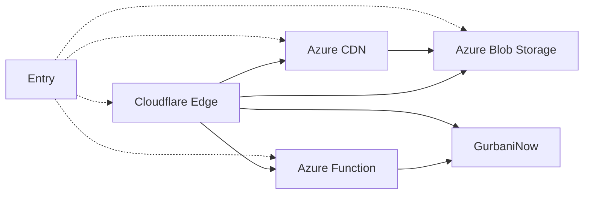

# Shabad OS Content API

This is a PoC, featuring:

- Azure Functions
- Cloudflare Edge
- Azure Blob Storage
- Azure CDN
- GurbaniNow API

Wired up, in an assortment of ways.

## Setup & Running

To work with the repo, install dependencies with `npm i`.

Start the Azure Functions with `npm start`, locally. To spin up any Cloudflare edge workers, `cd` into the desired edge folder (`shabad-edge`) and run `npx wrangler dev -l` for a local instance.

## Deployment

The majority of this setup is built with Pulumi as IaaC in TypeScript. After installing pulumi, running `pulumi up` with an appropriately configured Azure account will deploy any stack changes.

Unfortunately, the Cloudflare Worker provider in Pulumi does not support Cloudflare Worker modules with ES6 imports, therefore, these were manually uploaded with `npx wrangler publish`. An attempt at writing a custom REST provider for this use-case can be seen.
